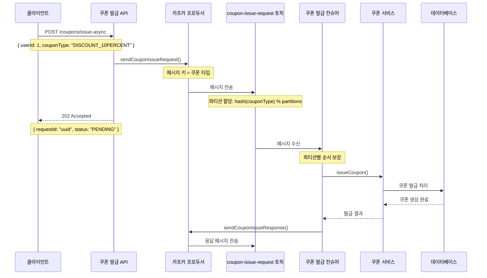
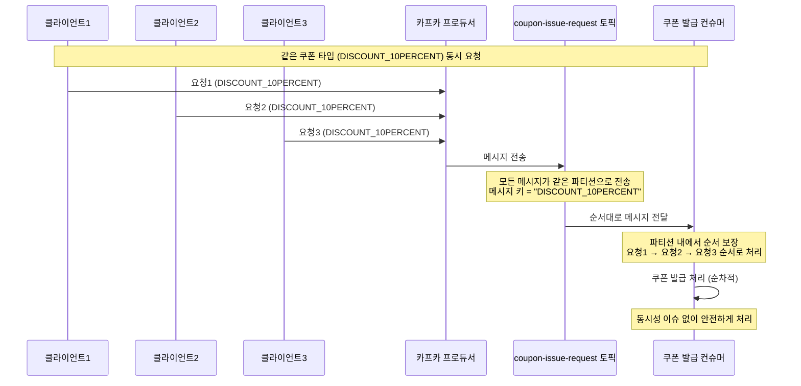
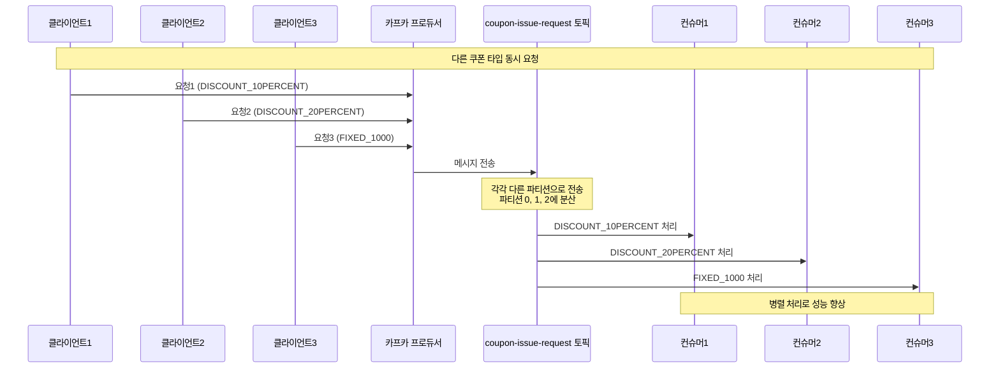

# Kafka 기반 쿠폰 발급 시스템 설계문서

Kafka의 파티션 기반 순서 보장을 활용하여 동시성 제어와 처리량 향상을 동시에 달성하는 쿠폰 발급 시스템

## 핵심 특징
- **파티션 기반 순서 보장**: 메시지 키를 쿠폰 타입으로 설정하여 같은 쿠폰 타입의 요청들이 같은 파티션에서 순서대로 처리
- **병렬 처리**: 다른 쿠폰 타입의 요청들은 다른 파티션에서 병렬 처리
- **비동기 처리**: 사용자는 즉시 요청 접수 응답을 받고, 실제 발급은 백그라운드에서 처리

## 시스템 아키텍처

### 컴포넌트 구성
- **프로듀서**: 쿠폰 발급 API 서버
- **토픽**: `coupon-issue-request` (요청), `coupon-issue-response` (응답)
- **컨슈머**: 쿠폰 발급 처리 컨슈머

### 파티션 전략
- **메시지 키**: 쿠폰 타입으로 설정
- **파티션 할당**: `hash(couponType) % numberOfPartitions`
- **순서 보장**: 같은 쿠폰 타입의 요청들은 같은 파티션에서 순서대로 처리
- **병렬 처리**: 다른 쿠폰 타입의 요청들은 다른 파티션에서 병렬 처리

## 시퀀스 다이어그램

### 1. 쿠폰 발급 요청 처리

### 2. 동시 요청 처리 (파티션 기반 순서 보장)

### 3. 다른 쿠폰 타입 병렬 처리

