# API 기능별 시퀀스 다이어그램

## 1. 포인트 관리 API

### 1.1 포인트 충전
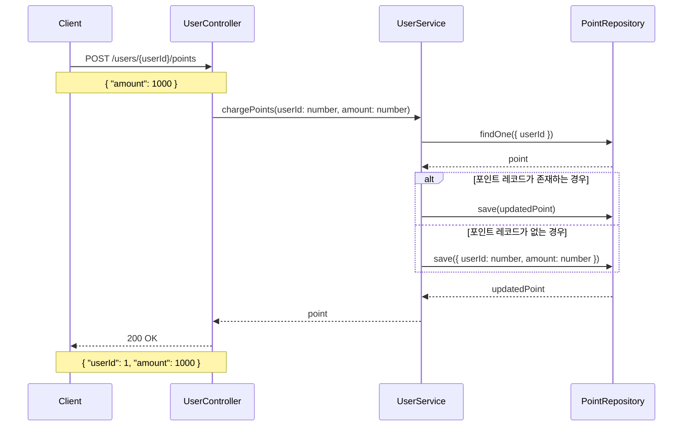

### 1.2 포인트 조회
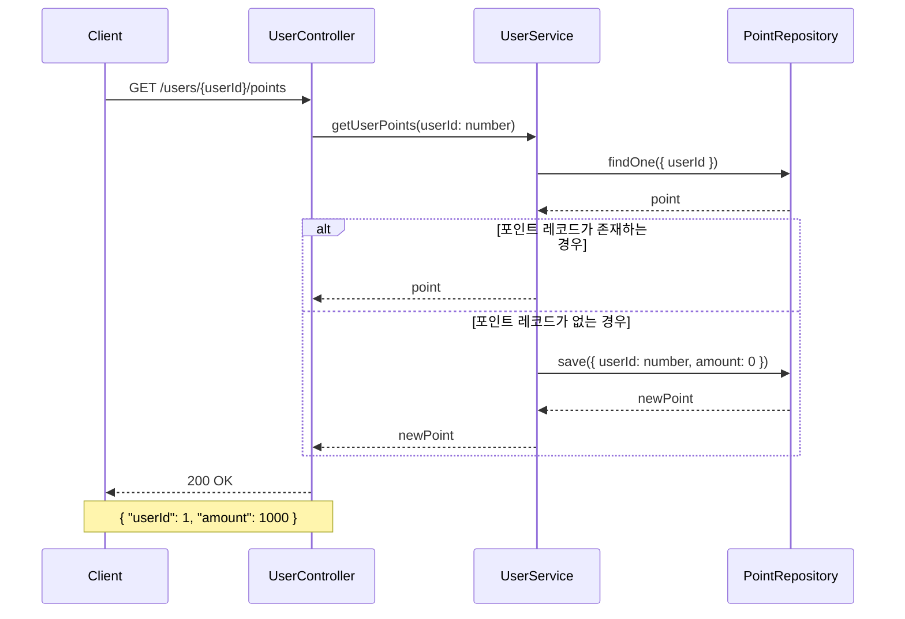

## 2. 상품 관리 API

### 2.1 상품 목록 조회
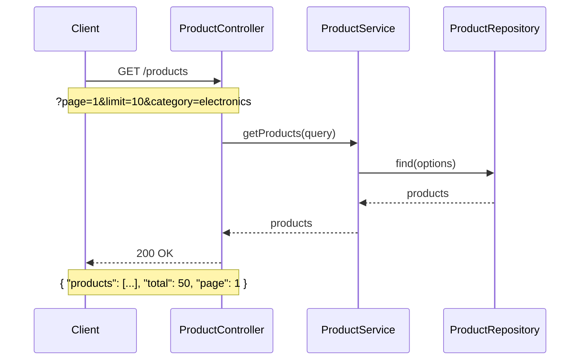

### 2.2 인기 판매 상품 조회
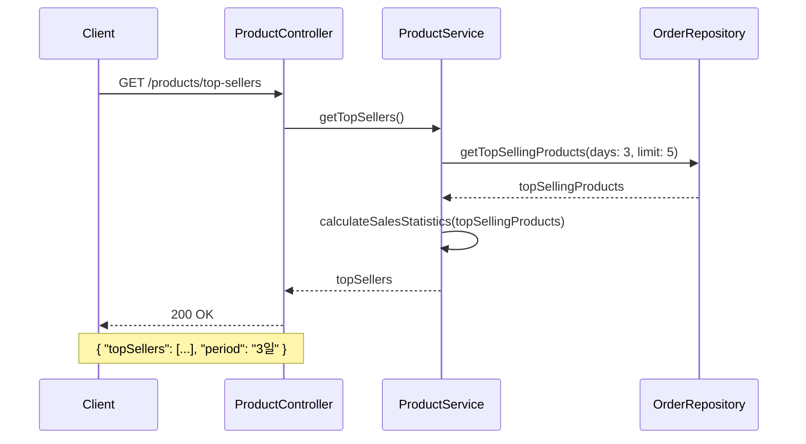

## 3. 쿠폰 관리 API

### 3.1 쿠폰 발급
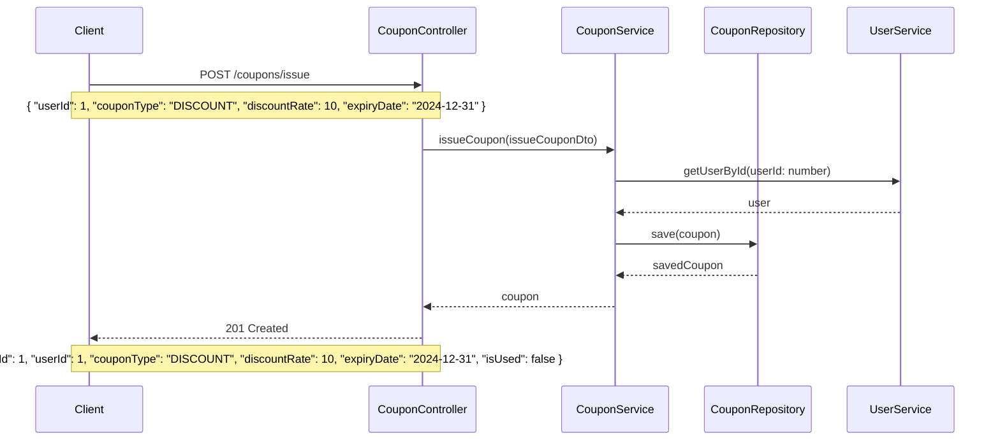

### 3.2 보유 쿠폰 조회
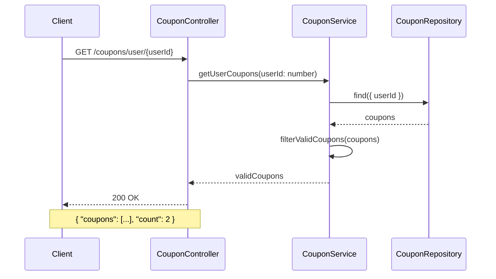

## 4. 주문 관리 API

### 4.1 주문 생성
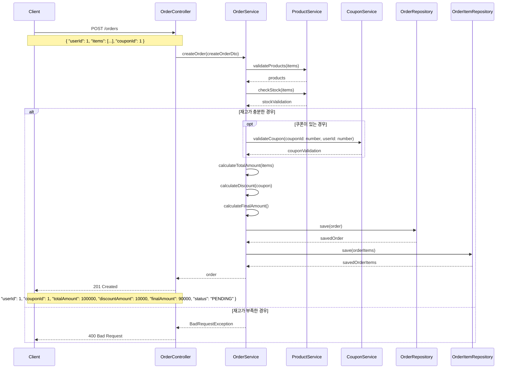

## 5. 결제 처리 API

### 5.1 결제 처리
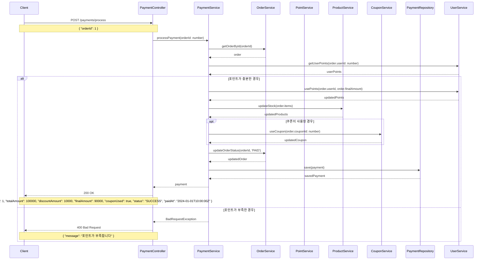

## 6. 에러 처리 시나리오

### 6.1 재고 부족 시 주문 실패
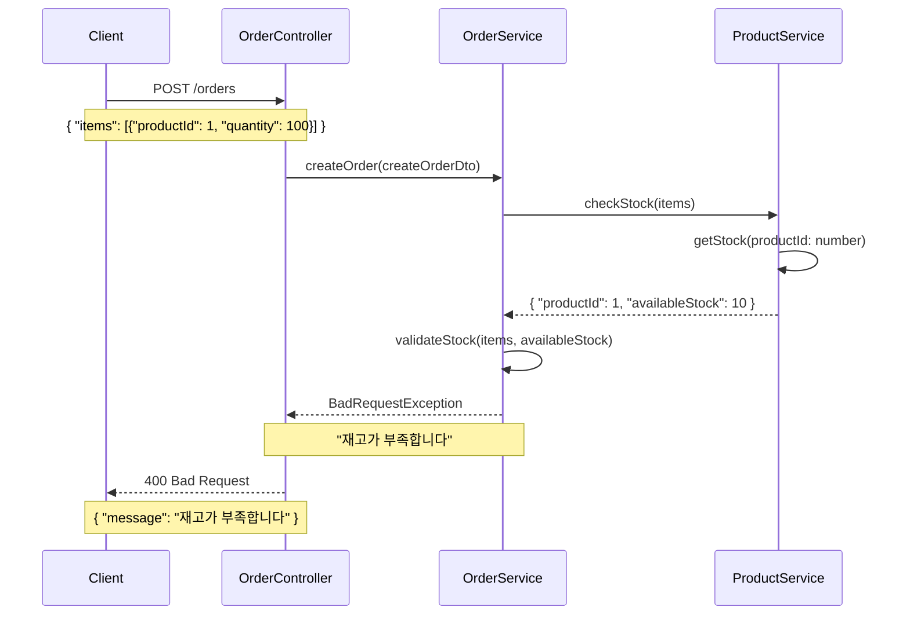

### 6.2 쿠폰 유효하지 않을 시 주문 실패
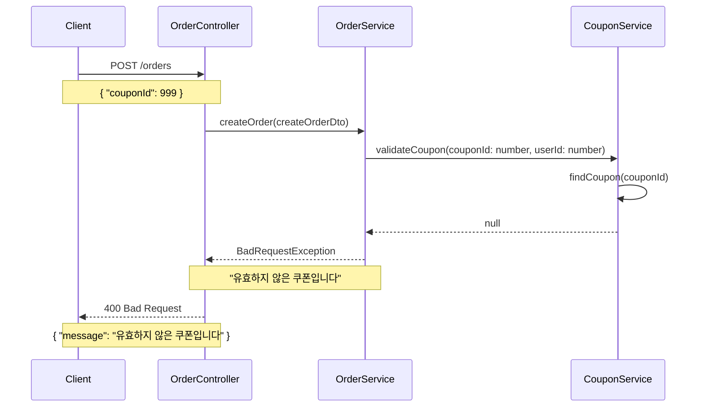

### 6.3 포인트 부족 시 결제 실패
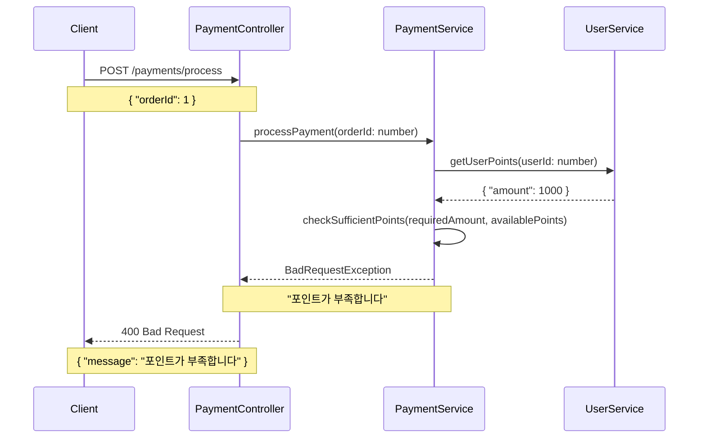